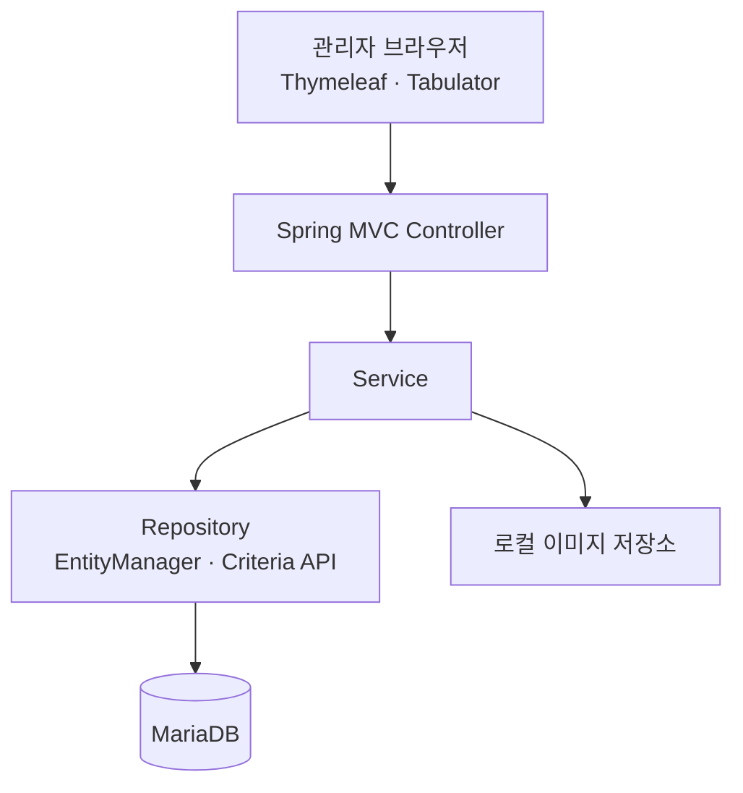

# F&B Admin

식음료(F&B) 서비스 운영에 필요한 상품, 옵션, 주문, 회원, 쿠폰 정보를 한곳에서 조회하고 관리하기 위한 Spring Boot 기반 관리자 웹 애플리케이션입니다.

서버 사이드 화면은 Thymeleaf로 구성하며, 목록 화면은 Tabulator의 원격 페이지네이션과 Spring MVC API를 연동합니다. 데이터 접근 계층은 JPA `EntityManager`와 Criteria API를 사용합니다.

## 주요 기능

| 영역 | 구현 내용 |
| --- | --- |
| 대시보드 | 예시 운영 지표 카드와 차트 UI |
| 주문 | 주문 목록 검색·페이지네이션, 주문 상품·옵션·결제 상세 조회 |
| 상품 | 상품 목록·상세 조회, 옵션과 이미지가 포함된 상품 등록 |
| 옵션 | 기본/추가 옵션 그룹 및 개별 옵션 조회, 자동완성 API |
| 회원 | 회원 목록 검색·페이지네이션, 회원 상세 및 등급 목록 조회 |
| 쿠폰 | 쿠폰 목록·상세 조회, 쿠폰 등록, 사용 현황 UI(데이터 연동 진행 중) |

> 현재 구현 범위는 주로 조회와 일부 등록 기능입니다. 수정·삭제, 인증/인가, 쿠폰 통계 데이터 연동 등은 아직 완성되지 않았습니다.

## 기술 스택

| 구분 | 기술 |
| --- | --- |
| Language | Java 17 |
| Backend | Spring Boot 3.5.6, Spring MVC, Spring Data JPA |
| View | Thymeleaf, Thymeleaf Layout Dialect |
| Database | MariaDB |
| Frontend | Bootstrap 5.3.3, Tabulator 6.3.1, Toast UI Editor, Chart.js |
| Build | Gradle 8.14.3 Wrapper |
| Utilities | Lombok |

## 구조



```text
src/main
├── java/com/fnbadmin
│   ├── config/                 # 정적 리소스와 업로드 이미지 매핑
│   ├── controller/
│   │   ├── request/            # 검색 및 등록 요청 DTO
│   │   ├── response/           # 화면/API 응답 DTO
│   │   ├── repository/         # JPA EntityManager 기반 데이터 접근
│   │   └── service/            # 도메인별 비즈니스 로직
│   ├── domain/                 # JPA 엔티티
│   └── util/                   # 상태 Enum, 이미지·엑셀 유틸리티
└── resources
    ├── static/                 # CSS, JavaScript, 이미지 자원
    ├── templates/              # Thymeleaf 화면과 공통 fragment
    └── application.properties  # 애플리케이션 기본 설정
```

## 실행 방법

### 1. 사전 요구 사항

- JDK 17 이상
- MariaDB
- Gradle 배포 파일과 Maven 의존성을 받을 수 있는 네트워크
- Tabulator, Toast UI Editor, Font Awesome 등 CDN 자원을 받을 수 있는 브라우저 네트워크

### 2. 저장소 받기

```bash
git clone https://github.com/leedoohee/fnb-admin.git
cd fnb-admin
```

### 3. 데이터베이스 준비

```sql
CREATE DATABASE fnb3
    CHARACTER SET utf8mb4
    COLLATE utf8mb4_unicode_ci;
```

기본 설정은 Hibernate `ddl-auto=update`이므로 애플리케이션 시작 시 엔티티를 기준으로 테이블을 생성하거나 갱신합니다. 별도의 마이그레이션 및 초기 데이터 파일은 아직 포함되어 있지 않습니다.

### 4. 실행 환경 설정

민감한 접속 정보는 저장소의 설정 파일을 직접 수정하기보다 환경 변수로 전달하는 방식을 권장합니다.

```bash
export SPRING_DATASOURCE_URL='jdbc:mariadb://localhost:3306/fnb3?serverTimezone=UTC&characterEncoding=UTF-8'
export SPRING_DATASOURCE_USERNAME='root'
export SPRING_DATASOURCE_PASSWORD='your-password'
export FILE_UPLOAD_DIR='/absolute/path/to/uploads'
```

Windows PowerShell에서는 다음과 같이 설정할 수 있습니다.

```powershell
$env:SPRING_DATASOURCE_URL = 'jdbc:mariadb://localhost:3306/fnb3?serverTimezone=UTC&characterEncoding=UTF-8'
$env:SPRING_DATASOURCE_USERNAME = 'root'
$env:SPRING_DATASOURCE_PASSWORD = 'your-password'
$env:FILE_UPLOAD_DIR = 'C:\fnb-admin\uploads'
```

### 5. 애플리케이션 실행

macOS/Linux:

```bash
bash gradlew bootRun
```

Windows:

```bat
gradlew.bat bootRun
```

실행 후 [http://localhost:8080/dashboard](http://localhost:8080/dashboard)에서 관리자 화면을 확인할 수 있습니다.

> 화면 내부 API 주소가 현재 `localhost:8080`으로 지정되어 있으므로 기본 포트 `8080` 사용을 권장합니다.

## 주요 화면 경로

| 화면 | 경로 |
| --- | --- |
| 대시보드 | `/dashboard` |
| 주문 관리 | `/order` |
| 상품 관리 | `/product` |
| 상품 옵션 관리 | `/product-option` |
| 회원 관리 | `/member` |
| 회원 등급 관리 | `/member-grade` |
| 쿠폰 관리 | `/coupon` |
| 쿠폰 사용 현황 | `/coupon-statistics` |

## 주요 API

| Method | Endpoint | 설명 |
| --- | --- | --- |
| `GET` | `/order/list` | 주문 목록 검색 및 페이지 조회 |
| `GET` | `/order/{orderId}` | 주문·상품·옵션·결제 상세 조회 |
| `GET` | `/product/list` | 상품 목록 검색 및 페이지 조회 |
| `GET` | `/product/{productId}` | 상품·옵션·첨부 이미지 상세 조회 |
| `POST` | `/product` | 상품, 옵션, 이미지 등록 (`multipart/form-data`) |
| `GET` | `/option-group/auto-complete` | 유형별 옵션 그룹 자동완성 |
| `GET` | `/option-group/{optionType}/list` | 유형별 옵션 그룹 목록 조회 |
| `GET` | `/option-group/{optionType}/{optionGroupId}` | 옵션 그룹 상세 조회 |
| `GET` | `/option/auto-complete` | 그룹별 옵션 자동완성 |
| `GET` | `/option/{optionGroupId}/list` | 그룹별 옵션 목록 조회 |
| `GET` | `/option/{optionGroupId}/{optionId}` | 옵션 상세 조회 |
| `GET` | `/member/list` | 회원 목록 검색 및 페이지 조회 |
| `GET` | `/member/{memberId}` | 회원 상세 조회 |
| `GET` | `/member-grade/list` | 회원 등급 목록 조회 |
| `GET` | `/coupon/list` | 쿠폰 목록 검색 및 페이지 조회 |
| `GET` | `/coupon/{couponId}` | 쿠폰 상세 및 적용 상품 조회 |
| `POST` | `/coupon` | 쿠폰 등록 |

목록 API는 Tabulator 원격 페이지네이션 형식에 맞춰 다음 구조로 응답합니다.

```json
{
  "last_page": 1,
  "data": []
}
```

## 핵심 도메인

- `Product` — `ProductOption`, `ProductAttachFile`
- `Order` — `OrderProduct`, `OrderOption`, `Payment`, `PaymentElement`
- `Member` — `MemberGrade`, `MemberPoint`, `MemberCoupon`
- `Coupon` — `CouponProduct`, `MemberCoupon`
- `OptionGroup` — `Option`

## 현재 제약 사항

- Spring Security 의존성과 인증 관련 코드가 비활성화되어 있습니다.
- 루트 경로(`/`) 매핑은 비활성화되어 있으므로 `/dashboard`로 접속해야 합니다.
- 프런트엔드 API URL 일부가 `http://localhost:8080`으로 고정되어 있습니다.
- 상품 이미지 저장 경로가 `ProductService`에도 로컬 절대 경로로 지정되어 있습니다. 다른 환경에서 이미지 업로드를 사용하려면 해당 부분을 `file.upload-dir` 설정과 연동해야 합니다.
- DB 마이그레이션, 샘플 데이터, 배포 설정은 포함되어 있지 않습니다.
- 테스트 의존성이 현재 비활성화되어 있어 테스트 실행 환경 정리가 필요합니다.

## 향후 개선 방향

- 관리자 인증 및 역할 기반 접근 제어 적용
- 상품·옵션·회원·쿠폰 수정/삭제 기능 보완
- 하드코딩된 URL과 파일 경로의 외부 설정화
- Flyway 또는 Liquibase 기반 스키마 버전 관리
- 예외 응답 표준화와 입력값 검증
- 단위·통합 테스트 및 CI 파이프라인 구성
